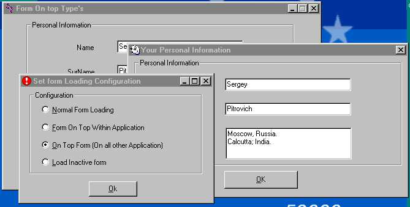



## Different On Top Forms

### Description

Different On Top Forms

This demonstrates you how to load form on deferent modes.

1. Normal form loading.

2. Model form loading.

3. On top form within application.

4. Global On top form (The form will be on Top even if your focus is on other application).

5. Loading inactive form (loading and showing a form while keeping the focus on the main form.).

Expecting your valuable feedback. Thanks!!
 
### More Info
 

             |
---                |---
**Submitted On**   |2003-05-14 15:55:48
**By**             |[Deepak Kumar Shaw](https://github.com/Planet-Source-Code/PSCIndex/blob/master/ByAuthor/deepak-kumar-shaw.md)
**Level**          |Intermediate
**User Rating**    |5.0 (10 globes from 2 users)
**Compatibility**  |VB 4\.0 \(32\-bit\), VB 5\.0, VB 6\.0
**Category**       |[Custom Controls/ Forms/  Menus](https://github.com/Planet-Source-Code/PSCIndex/blob/master/ByCategory/custom-controls-forms-menus__1-4.md)
**World**          |[Visual Basic](https://github.com/Planet-Source-Code/PSCIndex/blob/master/ByWorld/visual-basic.md)
**Archive File**   |[Different\_1587785142003\.zip](https://github.com/Planet-Source-Code/deepak-kumar-shaw-different-on-top-forms__1-45479/archive/master.zip)

